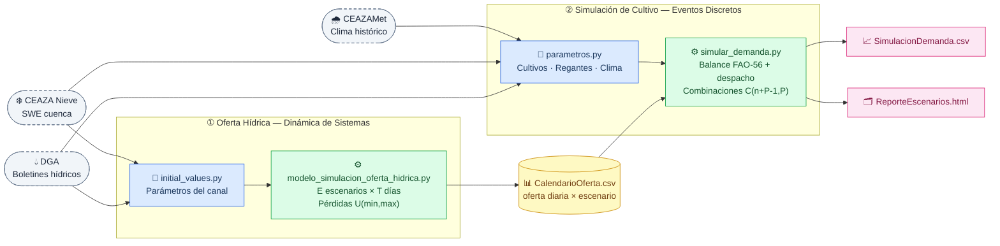
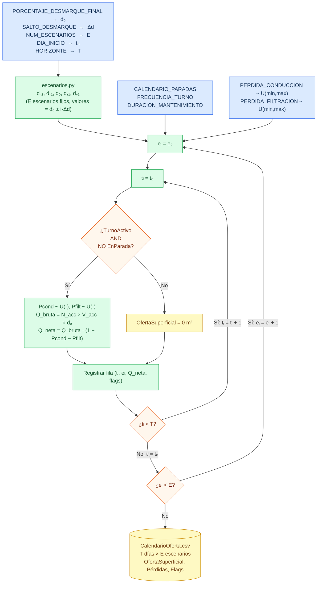
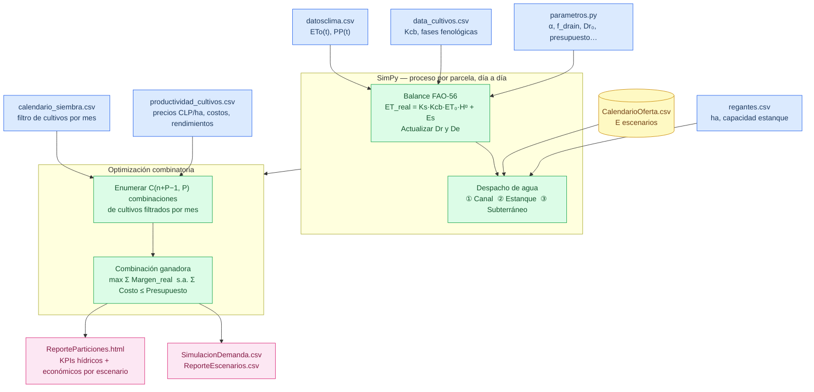
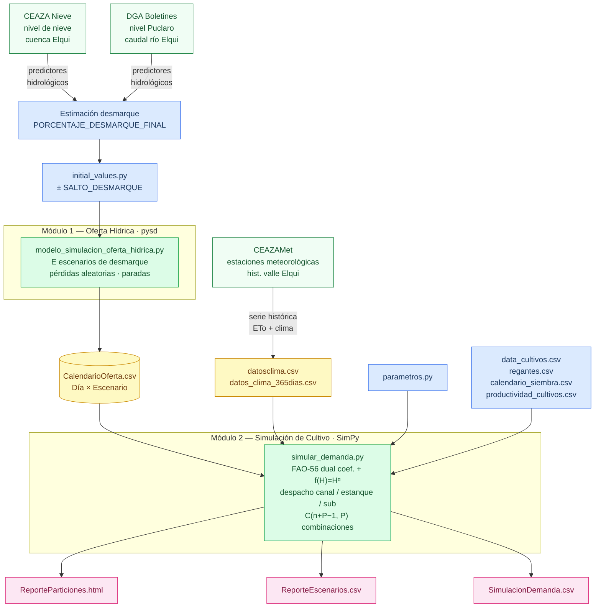

# Modelo de Soporte a la Toma de Decisiones en la Agricultura Basado en Simulación Multiparadigma

> **Proyecto:** Capstone — Simulación Multiparadigma para la Gestión del Agua de Riego  
> **Paradigmas:** Dinámica de Sistemas (Oferta Hídrica) · Simulación de Eventos Discretos (Demanda de Cultivo)  

---

## Tabla de Contenidos

1. [Objetivo del Sistema](#1-objetivo-del-sistema)
2. [Arquitectura General](#2-arquitectura-general)
3. [Módulo 1 — Oferta Hídrica (Dinámica de Sistemas)](#3-módulo-1--oferta-hídrica-dinámica-de-sistemas)
   - 3.1 Parámetros configurables
   - 3.2 Generación de escenarios de desmarque
   - 3.3 Lógica de apertura del canal
   - 3.4 Cálculo de pérdidas y oferta neta
   - 3.5 Salida: CalendarioOferta.csv
4. [Módulo 2 — Simulación de Cultivo (Eventos Discretos)](#4-módulo-2--simulación-de-cultivo-eventos-discretos)
   - 4.1 Balance hídrico FAO-56 doble coeficiente
     - Formulación base (potencial): $ET_c = (K_{cb}+K_e)\cdot ET_0$
     - Extensión 1 — estrés hídrico radicular ($K_s$)
     - Extensión 2 — retención no lineal por textura ($f(H)=H^\alpha$)
     - Extensión 3 — estado post-riego con fracción de drenaje ($f_{drain}$)
   - 4.3 Fuentes de agua y lógica de despacho
   - 4.4 Restricciones estacionales de siembra
   - 4.5 Optimización combinatoria de portafolio
   - 4.6 KPIs y reporte HTML
5. [Flujo de Datos end-to-end](#5-flujo-de-datos-end-to-end)
6. [Guía de Ejecución](#6-guía-de-ejecución)
7. [Archivos de Entrada y Salida](#7-archivos-de-entrada-y-salida)
8. [Referencias Bibliográficas](#8-referencias-bibliográficas)

---

## 1. Objetivo del Sistema

El presente modelo constituye un **sistema de soporte a la toma de decisiones** para regantes con derechos de agua en canal superficial y acceso optativo a fuentes subterráneas. El sistema aborda dos interrogantes centrales de la planificación agrícola bajo incertidumbre hídrica:

1. **¿Cuánta agua llega al predio?** — El subsistema de Oferta Hídrica modela el canal de distribución como un sistema de **stocks y flujos** mediante Dinámica de Sistemas. Las **variables de estado** (acumulaciones de agua) evolucionan temporalmente bajo la acción de tasas de entrada (desmarque) y salida (consumo y pérdidas estocásticas), lo que permite capturar la **dinámica acumulativa** de la oferta superficial a lo largo del horizonte de planificación, incluyendo paradas de mantenimiento y E escenarios de desmarque final.

2. **¿Qué cultivos plantar y cuándo regar?** — El subsistema de Demanda de Cultivo emplea **Simulación de Eventos Discretos** para representar el ciclo agronómico de cada parcela como una secuencia de **transiciones de estado** (siembra → desarrollo → madurez → cosecha) disparadas por **eventos** programados en el calendario de eventos del motor SimPy. La **asignación de recursos hídricos** —canal, estanque predial y fuente subterránea— se ejecuta en cada evento de riego mediante una lógica de despacho por prioridad.

La elección de un enfoque **multiparadigma** responde a la naturaleza fenomenológicamente distinta de ambos subsistemas: la oferta hídrica exhibe comportamiento **continuo y acumulativo** con retroalimentación (propio de la Dinámica de Sistemas), mientras que la demanda agrícola está gobernada por **eventos discretos** que marcan transiciones fenológicas y decisiones de riego. Ambos subsistemas están **desacoplados**: se comunican exclusivamente mediante el archivo intermedio `CalendarioOferta.csv`, lo que permite re-ejecutar cada módulo de forma independiente.

---

## 2. Arquitectura General

El sistema está compuesto por dos subsistemas de simulación desacoplados que intercambian estado a través de un archivo CSV intermedio. La selección del paradigma de simulación para cada subsistema responde a la estructura causal y temporal del fenómeno que representa: la Dinámica de Sistemas captura la evolución continua de stocks hídricos con estructura de retroalimentación, mientras que la Simulación de Eventos Discretos representa con fidelidad los procesos agronómicos gobernados por eventos discretos y transiciones de estado.



> **Principio de desacoplamiento:** ambos subsistemas son autónomos. La re-ejecución del Módulo 1 —ante una revisión del desmarque estimado— no requiere re-ejecutar el Módulo 2, y viceversa. El intercambio de estado entre subsistemas ocurre exclusivamente a través de `CalendarioOferta.csv`.

---

## 3. Módulo 1 — Oferta Hídrica (Dinámica de Sistemas)

El subsistema de Oferta Hídrica modela la evolución temporal del volumen de agua disponible en el predio a lo largo de un horizonte de T días. La **variable de estado** central es la oferta superficial neta diaria, cuya trayectoria resulta de la interacción entre las tasas de entrada (desmarque) y las tasas de salida estocásticas (pérdidas por conducción y filtración). La incertidumbre sobre el desmarque final se incorpora mediante E escenarios paralelos que exploran el espacio de realizaciones posibles.



### 3.1 Parámetros configurables

Todos los parámetros se definen en `src/initial_values.py`:

| Parámetro | Variable | Descripción |
|---|---|---|
| Acciones de agua | `NUMERO_ACCIONES` | Derechos del regante (unidades) |
| Volumen por acción | `VALOR_ACCION` | m³ por turno por acción (1 L/s × 12 h = 43.2 m³) |
| Desmarque inicial | `PORCENTAJE_DESMARQUE_INICIAL` | % del canal habilitado en la temporada actual (valor **conocido**) |
| Desmarque final | `PORCENTAJE_DESMARQUE_FINAL` | % del canal esperado tras el cambio de temporada (valor **incierto** — ver §3.2) |
| Fecha de cambio | `FECHA_DESMARQUE` | Formato `MM-DD` (ej. `09-01` = 1 sep) |
| **Salto de escenarios** | `SALTO_DESMARQUE` | Paso entre escenarios de desmarque (ej. 0.025 = 2.5%) |
| Pérdida filtración | `PERDIDA_FILTRACION` | Rango uniforme `(min, max)` como fracción del flujo |
| Pérdida conducción | `PERDIDA_CONDUCCION` | Rango uniforme `(min, max)` como fracción del flujo |
| Paradas de mantenimiento | `CALENDARIO_PARADAS` | Lista de días de inicio de cada parada |
| Duración mantenimiento | `DURACION_MANTENIMIENTO` | Días consecutivos de cierre por parada |
| Recargas subterráneas | `RECARGAS_AGUA_SUBTERRANEA` | Lista de tuplas `(MM-DD, m³)` |

#### Naturaleza de los parámetros de desmarque

El **desmarque inicial** corresponde al porcentaje de canal habilitado durante la temporada en curso: es un valor **conocido y fijo**, establecido por la organización de usuarios del canal al inicio de la temporada en función del agua disponible al momento.

El **desmarque final** es el porcentaje esperado para la siguiente temporada, que entra en vigencia a partir de `FECHA_DESMARQUE`. Este valor es **incierto al momento de la planificación**, ya que depende de variables hidrológicas que solo se conocerán con certeza al cierre del año. Las principales variables predictoras son:

- **Nivel de nieve** en la cuenca del río Elqui (indicador de recarga futura por deshielo)
- **Nivel del embalse Puclaro** (principal reservorio regulador del valle)
- **Caudal del río Elqui** (caudal actual como proxy de la disponibilidad hídrica corriente)

La estimación precisa del desmarque final debería provenir de un **modelo de regresión** entrenado con series históricas de esas tres variables como predictores y el desmarque observado como variable respuesta. Las fuentes de datos disponibles para construir ese modelo son (ver §9):

- Nivel de nieve: **CEAZA — Plataforma de monitoreo de nieves** (https://nieve.ceaza.cl)
- Nivel embalse Puclaro y caudal río Elqui: **DGA — Boletines hidrométricos** (https://dga.mop.gob.cl/servicios-de-informacion/boletines)
- Variables climáticas del modelo de demanda (`datosclima.csv`, `datos_clima_365dias.csv`) y complementarias para el modelo de desmarque: **CEAZAMet** (https://www.ceazamet.cl)

En la versión actual del modelo, el regante ingresa su mejor estimación como `PORCENTAJE_DESMARQUE_FINAL`, y el análisis de escenarios (§3.2) permite explorar el riesgo ante desvíos respecto de esa estimación.

### 3.2 Generación de escenarios de desmarque

Dado que el desmarque final es incierto, el modelo genera **E escenarios** que cubren un rango de posibles realizaciones alrededor de la estimación central del regante, variando en pasos de `SALTO_DESMARQUE`:

$$
d(i) = d_0 + i \cdot \Delta d, \quad i \in \{-2,\,-1,\,0,\,+1,\,+2\}
$$

donde $d_0$ = `PORCENTAJE_DESMARQUE_FINAL` y $\Delta d$ = `SALTO_DESMARQUE`.

Ejemplo con base = 15 % y salto = 2.5 %:

| Escenario | Desmarque final | Interpretación |
|---|---|---|
| −2 | 10 % | Temporada muy seca — embalse bajo, poca nieve |
| −1 | 12.5 % | Temporada moderadamente seca |
| 0 (base) | 15 % | Estimación central del regante |
| +1 | 17.5 % | Temporada moderadamente húmeda |
| +2 | 20 % | Temporada húmeda — buen nivel de nieve y embalse |

La lógica está implementada en `modulos/escenarios.py → generar_escenarios(iv)`. El escenario 0 se denomina *Principal*.

### 3.3 Condición de activación del flujo de entrada al predio

Para cada paso temporal $t$ y para cada escenario $e_i$, el **flujo de entrada** al predio es positivo únicamente cuando se satisfacen simultáneamente dos condiciones booleanas:

```
AperturaCanal = TurnoActivo  AND  NOT EnParada
```

- **TurnoActivo**: el paso temporal $t$ corresponde a un día de turno del regante (múltiplo de `FRECUENCIA_TURNO`).
- **EnParada**: $t$ cae dentro de una ventana de mantenimiento definida por `CALENDARIO_PARADAS` + `DURACION_MANTENIMIENTO`.

Cuando la condición no se satisface, el flujo de entrada al predio es nulo: $Q_{neta}(t) = 0$.

### 3.4 Modelado estocástico de pérdidas y oferta neta

Cuando el flujo de entrada está activo, la oferta bruta del regante constituye la **tasa de entrada** al stock predial:

$$
Q_{bruta} = N_{acc} \times V_{acc} \times d
$$

donde $N_{acc}$ = `NUMERO_ACCIONES`, $V_{acc}$ = `VALOR_ACCION`, $d$ = porcentaje de desmarque.

Las pérdidas de conducción y filtración se modelan como **variables aleatorias** con distribución uniforme, muestreadas independientemente en cada paso temporal:

$$
P_{cond} \sim U(\text{min}_{cond},\, \text{max}_{cond}), \quad P_{filt} \sim U(\text{min}_{filt},\, \text{max}_{filt})
$$

$$
P_{total} = P_{cond} + P_{filt}, \qquad Q_{neta} = Q_{bruta}\,(1 - P_{total})
$$

La **recarga subterránea** se incorpora como una perturbación puntual al stock de agua subterránea únicamente en la fecha exacta especificada en `RECARGAS_AGUA_SUBTERRANEA` (efecto no acumulativo entre periodos).

### 3.5 Salida: CalendarioOferta.csv

El archivo resultante tiene una fila por día × escenario con las columnas:

| Columna | Descripción |
|---|---|
| `Dia` | Día del año (1–365) |
| `Fecha` | Fecha calendario |
| `TurnoActivo` | Booleano — el turno corresponde a este regante |
| `EnParada` | Booleano — el canal está en mantenimiento |
| `AperturaCanal` | Booleano — el agua efectivamente llega al predio |
| `OfertaSuperficial` | m³ netos disponibles en el predio ese día |
| `PerdidaConduccion` | m³ perdidos por conducción |
| `PerdidaFiltracion` | m³ perdidos por filtración |
| `PerdidaTotal` | m³ totales perdidos |
| `PorcentajeDesmarque` | % de desmarque aplicado ese día |
| `RecargaSubterranea` | m³ recargados al acuífero (solo en fecha puntual) |
| `Escenario` | Identificador del escenario (−2 a +2) |

---

## 4. Módulo 2 — Simulación de Cultivo (Eventos Discretos)

El subsistema de Demanda de Cultivo determina la combinación óptima de cultivos y la estrategia de **asignación de recursos hídricos** que maximiza el margen económico, condicionada a la oferta superficial provista por el Módulo 1 vía `CalendarioOferta.csv`. Cada parcela se representa como una **entidad** SimPy que transita entre **estados fenológicos** (siembra → establecimiento → desarrollo → madurez → cosecha) mediante **eventos discretos** programados en el **calendario de eventos** del motor de simulación. La ejecución orientada a eventos (**event-driven execution**) avanza el reloj de simulación de evento en evento, sin procesar pasos temporales inactivos.



### 4.1 Balance hídrico FAO-56 doble coeficiente

#### Formulación base (potencial)

El enfoque de doble coeficiente FAO-56 (Allen et al., 1998) separa la evapotranspiración del cultivo en dos flujos físicamente distintos:

$$
ET_c = (K_{cb} + K_e)\cdot ET_0
$$

donde $ET_0$ es la evapotranspiración de referencia (mm/día) y los coeficientes escalan ese potencial climatológico: $K_{cb}$ para la **transpiración** de la planta y $K_e$ para la **evaporación** del suelo desnudo o húmedo entre plantas. Desagregando ambos flujos explícitamente:

$$
ET_c = \underbrace{K_{cb}\cdot ET_0}_{T_p \;(\text{transpiración potencial})} \;+\; \underbrace{K_e\cdot ET_0}_{E_s \;(\text{evaporación superficial})}
$$

- $K_{cb}(t)$ varía linealmente a lo largo de las fases fenológicas `ini → des → med → fin` según las duraciones `L_ini, L_des, L_med, L_fin` de `data_cultivos.csv`.
- $K_e(t)$ se rige por un balance de la capa superficial (energía disponible limitada por $K_{cb,max}$ y agua disponible en el estrato evaporativo $Ze$), con coeficiente de reducción $K_r$ cuando esa capa se ha secado.

#### Extensión 1 — estrés hídrico radicular ($K_s$)

La ecuación anterior es **potencial**: supone suelo a capacidad de campo. Cuando el déficit radicular $D_r$ supera el agotamiento fácilmente aprovechable (AFA), la planta ya no puede transpirar a tasa plena. FAO-56 introduce $K_s \in [0,1]$ que **pondera únicamente la transpiración** (la evaporación tiene su propio mecanismo de reducción a través de $K_r$ y el balance AET/AFE):

$$
T_{real}(t) = K_s(t)\cdot K_{cb}(t)\cdot ET_0(t)
$$

$$
K_s(t)=\begin{cases}
1 & D_r(t-1)\le \text{AFA} \\
\dfrac{\text{ADT}-D_r(t-1)}{\text{ADT}-\text{AFA}} & D_r(t-1)>\text{AFA}
\end{cases}
$$

con $\text{AFA} = p\cdot\text{ADT}$ (fracción de agotamiento sin estrés, parámetro $p$ del cultivo) y $\text{ADT} = 1\,000\cdot(CC - PMP)\cdot Z_r$ (agua disponible total en zona radicular, mm).

La $ET$ real bajo estrés —pero aún con reducción lineal en $D_r$— queda:

$$
ET_{real}(t) = K_s(t)\cdot K_{cb}(t)\cdot ET_0(t) + E_s(t)
$$

#### Extensión 2 — retención no lineal por textura ($f(H) = H^\alpha$)

$K_s$ lineal es una simplificación operativa reconocida por el propio FAO-56: asume que toda el agua entre AFA y el punto de marchitez es igualmente accesible. En suelos finos (franco, arcilloso), una fracción significativa queda retenida a tensiones matriciales que la planta no puede vencer, haciendo que la transpiración caiga **más rápido** que de forma lineal al secarse el perfil.

Para capturar ese comportamiento sin requerir los parámetros completos de Van Genuchten ($\theta_r$, $\theta_s$, $n$), se introduce un factor potencial análogo a la curva de Brooks & Corey (1964):

$$
f(H(t)) = H(t)^{\,\alpha}, \qquad H(t) = 1 - \frac{D_r(t-1)}{\text{ADT}} \in [0,1]
$$

donde $H$ es la humedad relativa de la zona radicular (1 = campo a capacidad, 0 = marchitez permanente). Aplicado solo a la transpiración, la ecuación implementada resulta:

$$
\boxed{ET_{real}(t) = K_s(t)\cdot K_{cb}(t)\cdot ET_0(t)\cdot H(t)^{\alpha} + E_s(t)}
$$

**Interpretación de $\alpha$:**

| Textura | Rango sugerido $\alpha$ | Comportamiento |
|---|---|---|
| Arenoso | 1.2 – 1.5 | Caída casi lineal; poca retención capilar |
| Franco | 1.5 – 2.0 | Caída moderadamente acelerada |
| Franco-arcilloso | 2.0 – 3.0 | Caída marcada antes del punto de marchitez |
| Arcilloso | 3.0 – 5.0 | Caída muy abrupta; alto agua retenida no disponible |

Con $\alpha = 1$ la expresión se reduce a $K_s \cdot K_{cb} \cdot ET_0 \cdot H$, que es equivalente al comportamiento FAO-56 estándar multiplicado por la humedad relativa. El parámetro se configura con `ALPHA_SUELO` en `parametros.py`.

#### Extensión 3 — estado del suelo post-riego con fracción de drenaje ($f_{drain}$)

El balance FAO-56 estándar supone que toda el agua aplicada queda disponible en la zona radicular hasta que se alcanza CC (cubeta perfecta). En la realidad, suelos con alta conductividad hidráulica (arena, franco-arenoso) drenan una fracción del agua aplicada **por debajo de la zona radicular el mismo día**, resultando en un estado de humedad final menor que el predicho por la cubeta simple.

La actualización del déficit radicular incorpora este efecto mediante una **fracción de drenaje inmediato** $f_{drain} \in [0, 1)$:

$$
D_r(t) = D_r(t-1) - PP(t)\cdot(1-f_{drain}) - R(t)\cdot(1-f_{drain}) + ET_{real}(t)
$$

Solo la fracción $(1-f_{drain})$ del agua aplicada (riego $R$ y precipitación $PP$) reduce efectivamente el déficit radicular. La capa superficial evaporante (balance de $D_e$) **no se modifica**, ya que el drenaje ocurre en profundidades mayores a $Z_e$.

| Textura | Rango sugerido $f_{drain}$ | Descripción |
|---|---|---|
| Arenoso | 0.30 – 0.45 | Drena rápido; retiene poca agua post-riego |
| Franco | 0.10 – 0.20 | Drenaje moderado |
| Franco-arcilloso | 0.02 – 0.08 | Drenaje lento |
| Arcilloso | 0.00 – 0.02 | Retiene casi toda el agua aplicada |

El parámetro `FRACCION_DRENAJE` en `parametros.py` es **calibrable con sensor volumétrico**: se mide $\theta$ antes y ~24 h después de un riego de volumen conocido (sin planta activa para eliminar la transpiración), y se ajusta $f_{drain}$ hasta que el modelo reproduce el $\theta$ final observado.

Los parámetros de suelo (`CC`, `PMP`, `Ze_evap`, `AET`, `AFE`) se definen en `parametros.py`. Las condiciones iniciales de déficit (`De0`, `Dr0`) se fijan en cero (suelo a capacidad de campo al inicio de la siembra).

### 4.3 Asignación de recursos hídricos (despacho por prioridad)

En cada **evento de riego** el simulador satisface la demanda neta del cultivo ($D_N = \max(0,\; ET_r - PP)$, donde $ET_r$ es la evapotranspiración real bajo estrés) asignando los **recursos hídricos disponibles** en el siguiente orden de prioridad:

```
1. CANAL (eventos de turno con flujo activo):
   a. Riego directo: min(OfertaCanal, DemandaNeta)  → aplicado en el evento actual
   b. Almacenamiento: excedente del canal → estanque predial (hasta capacidad máxima)
   c. Pérdida: excedente que supera capacidad del estanque

2. ESTANQUE (cualquier evento, si nivel > 0):
   - Extracción para completar la demanda neta no cubierta por el canal

3. SUBTERRÁNEO (si han transcurrido ≥ DIAS_SIN_RIEGO_PARA_SUBTERRANEA sin riego):
   - Extracción del stock subterráneo para cubrir el déficit hídrico residual
```

El **stock del estanque** se actualiza en cada evento de acuerdo con la ecuación de balance:

$$
N_{est}(t) = N_{est}(t-1) + A(t) - E(t)
$$

donde $A(t)$ = volumen almacenado y $E(t)$ = volumen extraído del estanque ese día.

con $N_{est} \in [0,\, C_{est}]$, donde $C_{est}$ es la capacidad máxima del **recurso de almacenamiento** predial, configurada en `regantes.csv`.

Las salidas de este bloque registran el estado de la **asignación de recursos** en las columnas `Canal_Riego_m3`, `Canal_Estanque_m3`, `Aplicado_m3`, `Subterranea_Usada_m3` y `Perdida_m3` del CSV de simulación diaria.

### 4.4 Restricciones estacionales de siembra

El archivo `inputs/calendario_siembra.csv` define, para cada **entidad cultivo**, en qué meses es posible **iniciar el proceso de simulación** (1 = disponible, 0 = restringido):

| nombre | enero | febrero | … | diciembre |
|---|---|---|---|---|
| lechuga_escarola | 0 | 1 | … | 0 |
| tomate | 1 | 0 | … | 1 |
| … | … | … | … | … |

Al iniciar la ejecución, el motor convierte `DIA_INICIO_SIMULACION + DIA_SIEMBRA` a mes calendario y filtra `data_cultivos.csv` conservando únicamente las entidades cultivo con valor 1 en esa columna. El filtro se aplica **antes** de construir las combinaciones del optimizador, reduciendo el espacio de búsqueda.

### 4.5 Optimización combinatoria de portafolio

El regante divide su superficie en `PARTICIONES` parcelas iguales ($ha_{part} = ha_{total} / P$). Para cada escenario de oferta, el motor de simulación determina la **combinación óptima de $P$ entidades cultivo** (con repetición permitida) que maximiza el margen económico total.

**Espacio de búsqueda:**

El número de combinaciones es la combinación con repetición de $n$ cultivos en $P$ posiciones:

$$
\binom{n + P - 1}{P}
$$

Por ejemplo con $n = 8$ cultivos disponibles y $P = 4$ particiones → $\binom{11}{4} = 330$ combinaciones. Con $n = 6$ cultivos (restricción estacional de agosto) y $P = 4$ → $\binom{9}{4} = 126$ combinaciones.

**Algoritmo de búsqueda exhaustiva:**

Para un portafolio de $P$ particiones, el motor evalúa **todas** las combinaciones de forma exhaustiva (búsqueda completa en el espacio combinatorio). La combinación ganadora es aquella que maximiza:

$$
\text{score} = \sum_{i=1}^{P} \text{Margen}_{real,i} \quad \text{sujeto a} \quad \sum_{i=1}^{P} \text{Costo}_i \le \text{Presupuesto}
$$

donde el margen real considera tanto el margen de comercialización como el costo de los insumos hídricos.

### 4.6 KPIs y reporte HTML

#### Fuentes y metodología de los parámetros económicos

Los datos de `productividad_cultivos.csv` provienen de dos fuentes oficiales del ODEPA, con ajuste por IPC:

**Precios de venta (columnas `enero`–`diciembre`, CLP/ha):**

Obtenidos del sistema [Series de tiempo — Precios Hortalizas](https://aplicativos.odepa.gob.cl/series-precios/series-tiempo) (ODEPA). Para cada cultivo se consultó con la siguiente configuración:

- Tipo de precios: *Precios mayoristas*
- Subsector: *Hortalizas y tubérculos*
- Tipo de precios: *Reales* (ajustados por IPC a la fecha de consulta)
- Tipo consulta: *Serie anual*

Para cada cultivo se descargó la serie mensual 2014–2025 con IPC ajustado. El precio representativo de cada mes se calculó como el **promedio intermensual**: promedio de todos los valores de enero entre 2014 y 2025, luego todos los febreros, etc. El precio unitario (CLP por unidad comercial) se multiplicó por el rendimiento (`rendimiento`) para convertirlo a **CLP/ha**, que es el valor almacenado en cada columna mensual. La unidad comercial de cada cultivo queda registrada en la columna `unidad` (`kg` para tomate, `unidad` para el resto): determina qué mide `rendimiento` y cómo se etiqueta la producción en el reporte.

**Rendimiento y costo (columnas `rendimiento`, `costo`, CLP/ha y unidades/ha ó kg/ha):**

Extraídos de las [Fichas de Costo de Hortalizas](https://www.odepa.gob.cl/fichas-de-costo-de-hortalizas) (ODEPA). Los valores de ficha están expresados en pesos nominales del año de publicación; se aplicó un **ajuste proporcional al mismo IPC** utilizado en la consulta de series de tiempo (IPC de 04/2026) para llevar costos y rendimientos a valores reales comparables con los precios.

Por cada combinación óptima el modelo calcula los siguientes indicadores:

**Hídricos:**

| KPI | Descripción |
|---|---|
| `OfertaCanal_total_m3` | Agua total llegada del canal (riego + estanque + pérdida) |
| `Canal_Riego_m3` | Fracción del canal usada directamente en riego |
| `Canal_Estanque_m3` | Fracción del canal almacenada en estanque |
| `Perdida_m3` | Agua del canal desperdiciada (desborde de estanque) |
| `Subterranea_m3` | Agua extraída del acuífero |
| `Theta_vol_med_%` | Humedad volumétrica media en zona radicular |
| `Estanque_medio_m3` | Nivel medio del estanque durante la temporada |
| `Cobertura_ETc_%` | Fracción de la demanda de ET cubierta efectivamente |

**Económicos:**

| KPI | Descripción |
|---|---|
| `Rendimiento_kg_ha` | Rendimiento estimado ajustado por estrés hídrico |
| `Ingreso_bruto_clp` | Precio × rendimiento × superficie |
| `Costo_clp` | Costo de insumos y producción |
| `Margen_real_clp` | Ingreso bruto − costo (objetivo de optimización) |

El reporte `ReporteParticiones.html` presenta para cada escenario los siguientes elementos:
- Indicadores clave (KPI cards) con la descomposición del volumen del canal (riego / almacenamiento / pérdida con porcentajes)
- Trayectoria temporal de la humedad volumétrica en la zona radicular
- Calendario de riego en dos paneles: *llegadas del canal* (desglose por destino) y *agua aplicada* (desglose por fuente)

### 4.7 Archivos de entrada — formatos de columnas

A continuación se describe la estructura exacta que deben tener los CSV de entrada del módulo 2. Cada fila de los archivos de múltiples regantes/cultivos representa un elemento independiente.

#### `datosclima.csv` — serie climática diaria

| Columna | Tipo | Descripción |
|---|---|---|
| `Fecha` | `YYYY-MM-DD` | Fecha del registro |
| `[Min] % Humedad Relativa` | float | Humedad relativa mínima diaria (%) |
| `[Prom] m/s Velocidad de Viento` | float | Velocidad media del viento (m/s) |
| `[Prom] mm Precipitación` | float | Precipitación media diaria (mm) |
| `[Prom] mm Evapotranspiración` | float | ET₀ de referencia diaria (mm) |

Fuente: CEAZAMet (estaciones meteorológicas del valle de Elqui).

#### `data_cultivos.csv` — parámetros fenológicos FAO-56

| Columna | Tipo | Descripción |
|---|---|---|
| `nombre` | str | Identificador del cultivo (clave de unión con otros CSV) |
| `L_ini`, `L_des`, `L_med`, `L_fin` | int | Duración de cada fase fenológica (días) |
| `Kc_ini`, `Kc_med`, `Kc_fin` | float | Coeficiente de cultivo $K_c$ por fase |
| `Kcb_ini`, `Kcb_med`, `Kcb_fin` | float | Coeficiente basal $K_{cb}$ por fase |
| `h` | float | Altura máxima del cultivo (m), para calcular $K_{cb,max}$ |
| `p` | float | Fracción de agotamiento sin estrés (FAO-56 Tabla 22) |
| `Ze` | float | Profundidad de la capa evaporante (m) |
| `few` | float | Fracción del suelo expuesto al sol y húmedo |

#### `productividad_cultivos.csv` — parámetros económicos

| Columna | Tipo | Descripción |
|---|---|---|
| `nombre` | str | Identificador del cultivo |
| `enero` … `diciembre` | float | Precio mayorista mensual (CLP/ha, ajustado IPC 04/2026) |
| `costo` | float | Costo de producción total (CLP/ha) |
| `rendimiento` | float | Rendimiento esperado (kg/ha o unidades/ha) |
| `unidad` | str | `"kg"` o `"unidad"` — determina la unidad de `rendimiento` |

#### `regantes.csv` — características prediales

| Columna | Tipo | Descripción |
|---|---|---|
| `id` | int | Identificador único del regante |
| `nombre` | str | Nombre descriptivo |
| `frecuencia_dias` | int | Días entre turnos de riego |
| `hectareas` | float | Superficie total del predio (ha) |
| `fraccion_cultivada` | float | Fracción de la superficie efectivamente cultivada (0–1) |
| `capacidad_estanque_m3` | float | Capacidad máxima del estanque predial (m³) |
| `nivel_estanque_inicial_m3` | float | Nivel inicial del estanque al comenzar la simulación (m³) |

#### `calendario_siembra.csv` — restricciones estacionales

| Columna | Tipo | Descripción |
|---|---|---|
| `nombre` | str | Identificador del cultivo |
| `enero` … `diciembre` | int | `1` = siembra permitida ese mes; `0` = restringida |

---

## 5. Flujo de Datos end-to-end



---

## 6. Librerías y Paradigmas de Simulación

El proyecto implementa dos paradigmas de simulación mediante librerías Python especializadas, cada una seleccionada por su adecuación estructural al fenómeno representado:

### pysd — Dinámica de Sistemas (`Oferta Hídrica`)

| | |
|---|---|
| **Librería** | [`pysd`](https://pysd.readthedocs.io) v3.14.3 |
| **Paradigma** | Dinámica de Sistemas (System Dynamics) — simulación continua |
| **Aplicación** | Modela el subsistema de distribución de agua como un sistema de **stocks** (volúmenes acumulados) y **flujos** (tasas de entrada y salida) con **estructuras de retroalimentación**. Las **variables de estado** evolucionan en tiempo continuo discretizado, capturando la dinámica acumulativa del agotamiento hídrico a lo largo del horizonte de planificación bajo incertidumbre estocástica en las pérdidas. |

pysd permite codificar modelos de Dinámica de Sistemas directamente en Python sin requerir un diagrama Vensim/Stella externo; el módulo `modelo_simulacion_oferta_hidrica.py` define explícitamente los **niveles** (stocks), las **tasas** (flujos) y las ecuaciones de estado del sistema.

### SimPy — Eventos Discretos (`Simulación de Cultivo`)

| | |
|---|---|
| **Librería** | [`simpy`](https://simpy.readthedocs.io) ≥ 4.0.0 |
| **Paradigma** | Simulación de Eventos Discretos (Discrete-Event Simulation) |
| **Aplicación** | Modela el ciclo agronómico de cada parcela como una **entidad** con **procesos** concurrentes que ejecutan **transiciones de estado** (fenológicas e hídricas) al ocurrir **eventos** programados en el **calendario de eventos** del motor. La ejecución orientada a eventos avanza el reloj de simulación únicamente cuando ocurre un evento, lo que es computacionalmente eficiente para horizontes largos con baja densidad de eventos activos. |

### Instalación de dependencias

```powershell
# Desde la raíz del proyecto
& ".venv\Scripts\python.exe" -m pip install -r "Oferta Hidrica\requirements.txt"
& ".venv\Scripts\python.exe" -m pip install -r "Simulación Cultivo\requirements.txt"
```

---

## 7. Guía de Ejecución

### Paso 1 — Ejecutar la Oferta Hídrica

```powershell
# Desde la raíz del proyecto
$env:PYTHONIOENCODING='utf-8'
cd "Oferta Hidrica"
echo "si" | & "..\\.venv\Scripts\python.exe" modelo_simulacion_oferta_hidrica.py
```

Parámetros clave a ajustar en `src/initial_values.py`:
- `PORCENTAJE_DESMARQUE_FINAL` — desmarque base del escenario central
- `SALTO_DESMARQUE` — diferencia entre escenarios consecutivos (ej. 0.025)
- `CALENDARIO_PARADAS` — días de inicio de mantenimiento

### Paso 2 — Ejecutar la Simulación de Cultivo

```powershell
cd "..\Simulación Cultivo"
& "..\\.venv\Scripts\python.exe" simular_demanda.py
```

Parámetros clave en `parametros.py`:
- `DIA_INICIO_SIMULACION` — día del año en que arranca la simulación (1 = 1 ene, 213 = 1 ago)
- `REGANTE_ID` — selecciona el regante desde `regantes.csv`
- `PARTICIONES` — número de parcelas en que se divide la superficie
- `ALPHA_SUELO` — factor de retención por textura (1.5 franco, 2.0 franco-arcilloso)
- `STOCK_SUBTERRANEO_INICIAL_M3` — volumen inicial del acuífero disponible
- `DIAS_SIN_RIEGO_PARA_SUBTERRANEA` — umbral de días secos para habilitar el pozo

### Paso 3 — Ver resultados

Abrir `Simulación Cultivo/outputs/ReporteParticiones.html` en cualquier navegador.

---

## 8. Archivos de Entrada y Salida

### Entradas del Módulo de Oferta Hídrica

| Archivo | Descripción |
|---|---|
| `src/initial_values.py` | Todos los parámetros del canal |
| `data/inputs/CalendarioParadas.csv` | Generado automáticamente desde `CALENDARIO_PARADAS` |

### Entradas del Módulo de Cultivo

| Archivo | Columnas clave | Descripción |
|---|---|---|
| `inputs/data_cultivos.csv` | `nombre, L_ini/des/med/fin, Kcb_ini/med/fin, h, p, Ze, few` | Coeficientes FAO-56 por cultivo |
| `inputs/datosclima.csv` | `Dia, ETo_mm, PP_mm, Tmax, Tmin` | ETo y precipitación diaria (365 días) |
| `inputs/regantes.csv` | `id, hectareas, fraccion_cultivada, frecuencia_turno, capacidad_estanque_m3` | Datos del regante |
| `inputs/calendario_siembra.csv` | `nombre, enero, …, diciembre` | Disponibilidad mensual por cultivo (binario) |
| `inputs/productividad_cultivos.csv` | `nombre, precio_clp_kg, rendimiento_kg_ha, costo_clp_ha` | Parámetros económicos |
| `../Oferta Hidrica/data/outputs/CalendarioOferta.csv` | Ver §3.5 | Oferta superficial diaria por escenario |

### Salidas

| Archivo | Descripción |
|---|---|
| `Oferta Hidrica/data/outputs/CalendarioOferta.csv` | Oferta diaria por escenario (365 × E filas) |
| `Simulación Cultivo/outputs/ReporteParticiones.html` | Reporte interactivo con KPIs y gráficos |
| `Simulación Cultivo/outputs/ReporteParticiones.csv` | KPIs por escenario × partición |
| `Simulación Cultivo/outputs/SimulacionParticiones.csv` | Balance hídrico diario detallado |

---

## 9. Referencias Bibliográficas

- **Allen, R.G., Pereira, L.S., Raes, D., Smith, M. (1998).** *Crop evapotranspiration — Guidelines for computing crop water requirements.* FAO Irrigation and Drainage Paper 56. Food and Agriculture Organization of the United Nations, Rome.

- **Brooks, R.H., Corey, A.T. (1964).** *Hydraulic properties of porous media.* Hydrology Papers No. 3. Colorado State University, Fort Collins.

- **Van Genuchten, M.Th. (1980).** A closed-form equation for predicting the hydraulic conductivity of unsaturated soils. *Soil Science Society of America Journal*, 44(5), 892–898.

---

## 10. Fuentes de Datos

- **ODEPA — Series de tiempo, precios hortalizas.** Sistema de consulta de precios mayoristas por subsector. Oficina de Estudios y Políticas Agrarias, Ministerio de Agricultura, Chile. Disponible en: https://aplicativos.odepa.gob.cl/series-precios/series-tiempo. Consulta: mayo 2026. Configuración utilizada: precios mayoristas, hortalizas y tubérculos, precios reales (IPC base 04/2026), serie anual 2014–2025.

- **ODEPA — Fichas de costo de hortalizas.** Fichas técnicas con rendimientos y costos de producción por cultivo. Oficina de Estudios y Políticas Agrarias, Ministerio de Agricultura, Chile. Disponible en: https://www.odepa.gob.cl/fichas-de-costo-de-hortalizas. Consulta: mayo 2026. Valores actualizados a precios reales mediante el mismo índice IPC utilizado en las series de tiempo.

- **CEAZA — Plataforma de monitoreo de nieves.** Cobertura y equivalente en agua de la nieve en la cuenca del río Elqui. Centro de Estudios Avanzados en Zonas Áridas (CEAZA), La Serena. Disponible en: https://nieve.ceaza.cl. Consulta: mayo 2026. Fuente principal para el predictor *nivel de nieve* del modelo de regresión de desmarque.

- **CEAZAMet — Estaciones meteorológicas.** Series históricas de variables climáticas de la red de estaciones del valle del Elqui. Centro de Estudios Avanzados en Zonas Áridas (CEAZA). Disponible en: https://www.ceazamet.cl. Consulta: mayo 2026. Fuente utilizada para construir los archivos de datos climáticos del modelo de demanda (`datosclima.csv`, `datos_clima_365dias.csv`), y fuente de variables climáticas complementarias para el modelo predictivo de desmarque.

- **DGA — Boletines hidrométricos.** Series históricas de nivel del embalse Puclaro y caudal del río Elqui. Dirección General de Aguas, Ministerio de Obras Públicas, Chile. Disponible en: https://dga.mop.gob.cl/servicios-de-informacion/boletines. Consulta: mayo 2026. Fuentes de los predictores *nivel embalse Puclaro* y *caudal río Elqui* para el modelo de regresión de desmarque.
